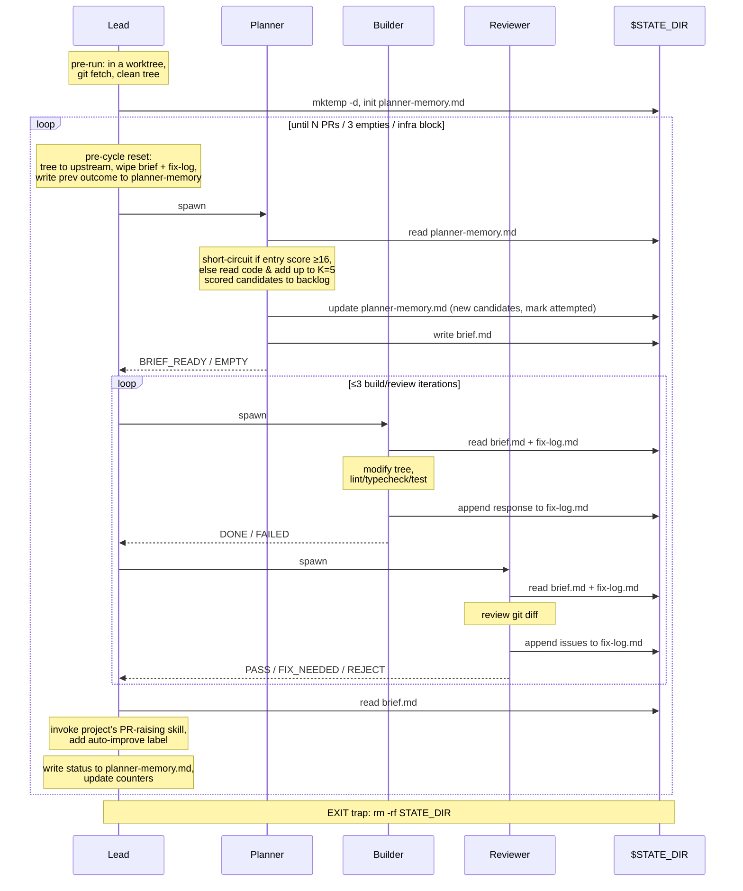

# Auto-Improve

Autonomous improvement loop. Finds issues in a project, implements fixes, raises PRs — unattended, until a target PR count is hit, three cycles come back empty, or infrastructure breaks.

## Invocation

Run from inside a worktree (under `.claude/worktrees/`). The Lead aborts on uncommitted changes or if the working directory isn't a worktree. The default branch is auto-detected from `origin/HEAD` (works with both `main` and `master`).

Optional argument is free-form natural language:

- _"5 cycles"_ — set PR target (default 10).
- _"focus on the auth module"_ — pass a focus hint to the Planner.

## Agents

- **Lead** (your session) — orchestrator. Pre-run safety checks, per-cycle reset, state files, counters, stop conditions, PR raising. Lives in `SKILL.md`.
- **Planner** (ephemeral, per cycle) — picks the next improvement using a Severity × Confidence backlog with two-gate exploration. See `references/planner.md`.
- **Builder** (ephemeral, per build/fix) — modifies the working tree, runs lint/typecheck/test. Implements the brief or addresses the latest Reviewer round. See `references/builder.md`.
- **Reviewer** (ephemeral, per review) — adversarial semantic review. Returns `PASS` / `FIX_NEEDED` / `REJECT`. See `references/reviewer.md`.

## Cycle flow



1. Pre-cycle reset (`main` clean, wipe `brief.md`/`fix-log.md`, write previous outcome onto `planner-memory.md`).
2. Planner picks an entry from the backlog, writes `brief.md`, marks `attempted`.
3. Build/review loop (≤3 iterations): Builder modifies + checks → Reviewer reviews. `PASS` exits, `FIX_NEEDED` re-loops, `REJECT` or exhaustion empties.
4. Lead opens the PR via the project's PR-raising skill.
5. Lead writes the cycle outcome (`shipped` / `diff_rejected` / `builder_failed` / `rejected`) onto the picked entry, updates counters.

Stops on: target hit | 3 consecutive empties | infrastructure block.

## Files

```
SKILL.md                        Lead instructions (orchestrator)
README.md                       This file
references/planner.md           Planner instructions
references/builder.md           Builder instructions
references/reviewer.md          Reviewer instructions
evals/                          Scenario-based evaluation harness
```
