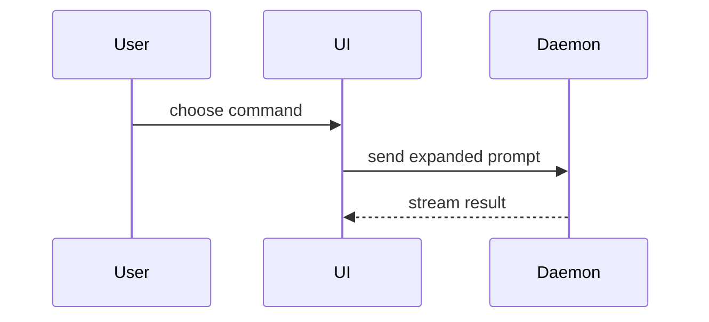

# Pull request standards

## Title and branch

Conventional Commits, lowercase: the commit, the PR title, and the branch (`<type>/<kebab-desc>`) all carry the same type. Recheck the type whenever the WHY changes, because the WHY decides what the change is. In a worktree, rename the branch the harness created instead of branching off it.

## The WHY comes from the person, not the diff

Lead the description with why the change was made, as the conversation told you. The diff is ground truth for what changed and can confirm a reason, but it cannot supply one: a plausible motive read off the code is a guess, and a guessed WHY is the one error a reviewer cannot detect. Where no reason was given, write "motivation not recorded" at that point and open the PR as a draft, then end the turn by asking the person in chat why the change was made. Do not leave the gap for them to fill on GitHub: only they can supply the reason, so the run ends on that question. When the answer comes, write the WHY in, recheck the type, and mark the PR ready.

## Description

Write for a reviewer with a few minutes and little energy to spare: they take in the change at a glance and then find what they need to approve it, and a wall of prose loses them before either happens. Describe the change as the people affected by it experience it, not as the code that implements it. Pick whatever structure explains this change best; there is no template and no test plan.

The reviewer reads the description with the diff open. Say only what the diff cannot, and say it once: the why, what the people affected now see, and a judgment call a reviewer would question. A fact the diff shows plainly — a token name, an export path, a config entry, how the code or a style works — is not restated; a prose walk through the code is what made past descriptions dense. A doc the PR changes, such as a design or context file, carries the decisions it records, so name it rather than repeat it. Length never follows the size of the diff, and a description never grows to list every change made or to give every decision its reason.

A non-obvious bug — one rooted in how a library or platform works rather than in a coding mistake — deserves its mechanism explained in depth, written for a reader who has forgotten how that part of the library works. Re-establish how the mechanism normally works before what went wrong and why it stayed hidden, in short paragraphs or a diagram, never one packed paragraph. A bug stated only in the library's own terms teaches nothing to a reader who no longer has that library's model in their head.

Do not report verification — the commands run, the suites passed, the manual checks. A PR is raised only after the change is verified, so there is nothing to say about it. A number that shows the change's effect, such as an error count at zero, is part of the change and stays.

Leave nothing for the reviewer to do before approving: no "please verify", no open questions, no decisions still to make. Anything unsettled means the PR was not ready to raise. Ideas for follow-up work stay out for the same reason — they are not in this diff. A judgment call goes in only where a reviewer would otherwise question it, and then as settled, with its reason, never offered up for debate — "four choices a reviewer may want to weigh in on" is the shape to avoid. A reason for every decision is the other shape to avoid; it turned past descriptions into a wall.

Do not argue the change's case — proving what it did not break, or what another PR did not cause. A fact that matters, such as the bug predating this branch, gets one clause, not a paragraph.

Write plain natural prose in short sentences and remove all mannered prose — metaphor or flourish where a literal phrase exists. Keep a paragraph to one point in a few sentences. Bold the phrase that carries a key paragraph's point so a scan finds it, and use a heading or list only where the content has that shape: several changes in one PR are a list, a line or two each, not a packed paragraph per change. (These sentences correct Fable 5.1, which writes long packed sentences and paragraphs and under-formats; retest them when the model changes.)

A structural change is expected to carry a visual, and prose is for the meaning a visual cannot carry. Show the change as a diff against the existing shape, so the reviewer sees what moved without re-reading the whole. Keep only the nodes that make the point, and place the visual next to the sentence it supports. Match the notation to what the reviewer already reads for that kind of structure:

A component change, as JSX with opening tags only, keeping the hooks and boundaries that matter:

```diff
 <SessionPage>
   useSessionEvents()
   <SessionToolbar>
+    <RunSkillButton />
   <SessionTimeline>
+    <SkillResultCard />
```

A file-layout change, as a shallow file tree:

```diff
 src/
 ├── commands/
+│   └── show-me.ts       # expands the slash command
 ├── sessions/
-└── transport.ts
+└── transport/
+    ├── client.ts
+    └── stream.ts
```

A call-tree or call-stack change, as indented calls:

```diff
 submitForm
   createSession
     persistPrompt
+    expandSkillMention
     launchAgent
-  navigateToSession
+  navigateToSession
+    subscribeToEvents
```

A state or control-flow change, as pseudocode:

```diff
 on(save)
-  write content
+  if content is unchanged
+    return cached result
+  write new content
+  invalidate cache
```

A flow between parts, as a Mermaid diagram:



Keep each paragraph on one line, because GitHub turns a line break inside a paragraph into a hard break. When the change closes an issue, `Closes #<n>` is the last line.

## Screenshots

For a change to what a user sees rendered in a browser, show a before/after comparison directly under the WHY, so it reads as evidence rather than an appendix. `references/pr-media.md` has the gate (public repo, production URL), the capture and upload steps, and the embed format. When you edit a description, keep the `` tags already in it: the URLs stay live and re-uploading is waste.
