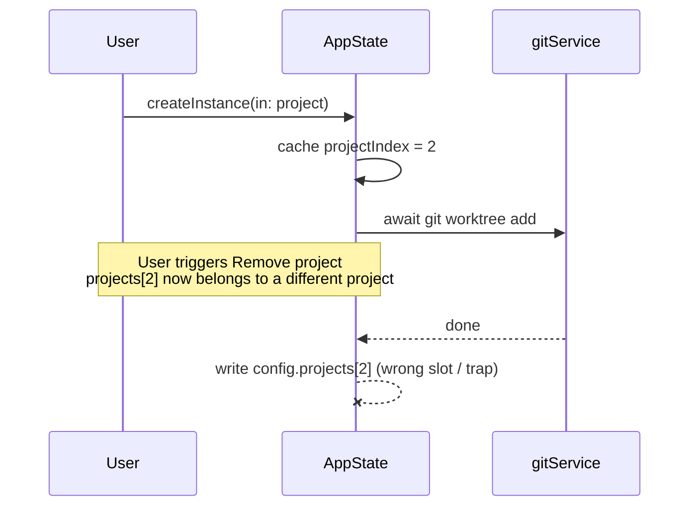

# PR Creation Examples

Examples demonstrating the complete flow from staged diff analysis to final PR.

## Example 1: Feature Addition (with Context section)

**Analysis passed to the PR-creation sub-agent:**

```
Summary: Implement authentication to secure the API, which currently allows unrestricted access — adds JWT token generation, validation middleware, and /login and /logout endpoints.
Change type: feat
Context: Uses stateless JWT tokens so we don't need session storage. The middleware pattern allows routes to opt-in to authentication, so public endpoints remain accessible.
Issue: none
Worktree: false
Base from main: false
Commit to current branch: false
Stack on: none
```

**Output** - Construct:

Branch: `feat/jwt-authentication`

PR Title / Commit: `feat: add JWT authentication`

PR Description:

```markdown
## Summary

Adds JWT-based authentication to secure the API. The API currently allows unrestricted access to all endpoints, which is a security gap we need to address before launch.

## Context

Uses stateless JWT tokens so we don't need session storage. The middleware pattern allows routes to opt-in to authentication, so public endpoints remain accessible.
```

## Example 2: Bug Fix (no Context section, linked to GitHub issue)

**Analysis passed to the PR-creation sub-agent:**

```
Summary: Fix a memory leak in the parser where event listeners were never removed after disposal, causing unbounded memory growth in long-running processes. Particularly problematic in server environments where the parser is instantiated frequently.
Change type: fix
Issue: 42
Worktree: false
Base from main: false
Commit to current branch: false
Stack on: none
```

**Output** - Construct:

Branch: `fix/parser-memory-leak`

PR Title / Commit: `fix: resolve memory leak in parser module`

PR Description:

```markdown
## Summary

Fixes a memory leak in the parser module. Event listeners were never being removed after disposal, causing unbounded memory growth in long-running processes. This was particularly problematic in our server environments where the parser is instantiated frequently.

Closes #42
```

## Example 3: Refactoring (with Context section)

**Analysis passed to the PR-creation sub-agent:**

```
Summary: Simplify state management by replacing Redux with the React Context API. Redux was over-engineered for this app's simple state needs — only a handful of global values and no complex async flows. Reduces state management code by ~60%.
Change type: refactor
Context: No functional changes to the application. The migration was done atomically to avoid any broken intermediate states.
Issue: none
Worktree: false
Base from main: false
Commit to current branch: false
Stack on: none
```

**Output** - Construct:

Branch: `refactor/context-api-migration`

PR Title / Commit: `refactor: migrate from Redux to Context API`

PR Description:

```markdown
## Summary

Replaces Redux with React Context API. Redux was over-engineered for this app's simple state needs — we only have a handful of global values and no complex async flows. This reduces state management code by ~60% and makes it easier to understand.

## Context

No functional changes to the application. The migration was done atomically to avoid any broken intermediate states.
```

## Example 4: Trivial fix (single-sentence summary, no Context)

**Analysis passed to the PR-creation sub-agent:**

```
Summary: Fixes a typo in the connection error message ("conncetion" → "connection").
Change type: fix
Issue: none
Worktree: false
Base from main: false
Commit to current branch: false
Stack on: none
```

**Output** - Construct:

Branch: `fix/error-message-typo`

PR Title / Commit: `fix: correct typo in connection error message`

PR Description:

```markdown
## Summary

Fixes a typo in the connection error message ("conncetion" → "connection").
```

## Example 5: Bundled multi-change PR (list format with grouping)

Use this format when the analysis describes 3+ distinct changes, 2+ independent subsystems, or a multi-step design process. Note the grouped subheadings in Summary and the numbered iteration list in Context.

**Analysis passed to the PR-creation sub-agent:**

```
Summary: Bundles six auto-improve improvements held pending eval re-runs: Planner eager-execute on validated HIGH findings, cross-run dedupe via gh pr list at Planner startup, hermetic skill snapshots for in-flight evals, compute-usage.py for cost/token capture across recursive sub-agent sessions, eval-shim-hook.sh PreToolUse hook intercepting mutating Bash, and report.html auto-open plus new evals/README.md.
Change type: feat
Context: Dedupe design went through three iterations (Lead-fetch → Explorer-fetch → Planner-fetch) before landing. Forced a clarification of the "Planner has no tools" rule — was conflating "don't read source code" (kept) with "no external queries at all" (dropped). Planner now has read-only gh access but keeps the "no source code, no working-tree mutation" invariant.
Issue: none
Worktree: false
Base from main: false
Commit to current branch: false
Stack on: none
```

**Output** — Construct:

Branch: `feat/auto-improve-batch-improvements`

PR Title / Commit: `feat: bundle auto-improve eager-execute, hermetic evals, and dedupe`

PR Description:

```markdown
## Summary

Six auto-improve improvements held pending eval re-runs, shipped together.

**Planner gets smarter**
- **Eager-execute** — sends EXECUTE on a validated HIGH finding instead of buffering
- **Cross-run dedupe** — fetches `gh pr list --label auto-improve` at startup and challenges the Explorer on findings that resemble prior PRs

**Eval infrastructure**
- **Hermetic skill snapshots** — in-flight evals immune to mid-run global skill edits
- **Cost capture** — new `compute-usage.py` walks recursive sub-agent sessions
- **Network shim hook** — `eval-shim-hook.sh` PreToolUse hook intercepts mutating Bash at every agent depth
- **Operator polish** — `report.html` auto-opens at end of run; new `evals/README.md`

## Context

Dedupe landed on the Planner after two rejected designs:

1. **Lead fetches, passes via Explorer brief** — rejected as unnecessary indirection.
2. **Explorer fetches directly** — rejected: biasing detection risks filtering adjacent-but-distinct issues.
3. **Planner fetches** — dedupe is triage, not detection.

This forced a rule clarification: "Planner has no tools" was conflating *don't read source code* (load-bearing — enforces explore/triage separation) with *no tools at all* (overreach). Planner now has read-only `gh` access; the "no source code, no working-tree mutation" invariant stays.
```

## Example 6: Complex flow fix with a Mermaid diagram

Use this format when the mechanics are genuinely flow-shaped — a race, a sequence across components, a state transition — and prose would force the reader to mentally simulate the interleaving. The diagram replaces the dense paragraph; it is not an extra.

**Analysis passed to the PR-creation sub-agent:**

```
Summary: Fix a race in AppState.createInstance/removeInstance where a cached projectIndex went stale across the `git worktree` await, so a concurrent "Remove project" landed writes on the wrong slot or trapped. Both methods now capture the project id, await, then re-resolve by id.
Change type: fix
Context: On createInstance, if the project vanished mid-await the orphaned worktree is surfaced via an error banner with its path for manual cleanup — auto-rollback via gitService.removeInstance was rejected because destructive follow-on without user confirmation compounds failure modes. On removeInstance, the parent-project mutation is skipped silently when the parent is gone, because the user already asked for the project to go away.
Issue: none
Worktree: false
Base from main: false
Commit to current branch: false
Stack on: none
```

**Output** — Construct:

Branch: `fix/re-resolve-project-after-await`

PR Title / Commit: `fix: re-resolve project by id after git await`

PR Description:

````markdown
## Summary

Fixes a race in `AppState.createInstance` / `removeInstance`: both cached `projectIndex` before awaiting `git worktree`, then wrote through the cached index after the await returned. If the user hit "Remove project" during the await, the cached index pointed at the wrong slot (silent misattribution) or past the end (trap). Both methods now capture the project id, await, then re-resolve by id.



## Context

On `createInstance`, if the project vanishes mid-await the orphaned worktree is surfaced via an error banner with its path for manual cleanup — auto-rollback via `gitService.removeInstance` was rejected because destructive follow-on without user confirmation compounds failure modes. On `removeInstance`, the parent-project mutation is skipped silently when the parent is gone, because the user already asked for the project to go away.
````
