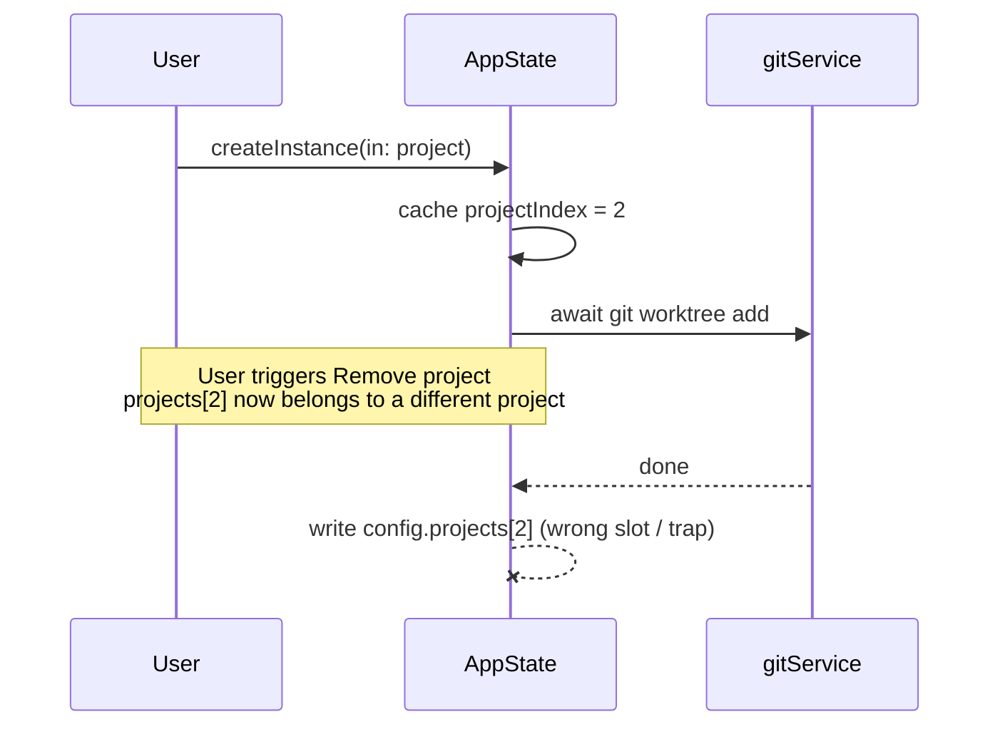

# PR Creation Examples

Examples demonstrating the complete flow from staged diff analysis to final PR.

## Example 1: Feature Addition (Summary template, with Notes)

**Analysis passed to the PR-creation sub-agent:**

```
Summary: Implement authentication to secure the API, which currently allows unrestricted access — adds JWT token generation, validation middleware, and /login and /logout endpoints.
Change type: feat
Notes: Uses stateless JWT tokens so we don't need session storage. The middleware pattern allows routes to opt-in to authentication, so public endpoints remain accessible.
Issue: none
Worktree: false
Base from main: false
Commit to current branch: false
Stack on: none
```

**Output** - Construct:

Branch: `feat/jwt-authentication`

PR Title / Commit: `feat: add JWT authentication`

PR Description:

```markdown
## Summary

Adds JWT-based authentication to secure the API, which currently accepts unauthenticated requests — a launch blocker.

The change introduces token generation, a validation middleware for protected routes, and `/login` / `/logout` endpoints.

## Notes

Tokens are stateless, so there's no session store to operate. Routes opt in to the middleware, leaving public endpoints reachable without a token.
```

The three additions stay in prose rather than bullets because they're one cohesive feature, not three independently-shippable changes (see the bullet-vs-paragraph test in `pr-creation.md`).

## Example 2: Bug Fix (Fix template, linked to GitHub issue)

**Analysis passed to the PR-creation sub-agent:**

```
Bug: Parser event listeners were never removed after disposal, causing unbounded memory growth in long-running processes — particularly bad in server environments where we instantiate parsers frequently.
Fix: Remove listeners in `dispose()` before dropping the reference.
Change type: fix
Issue: 42
Worktree: false
Base from main: false
Commit to current branch: false
Stack on: none
```

**Output** - Construct:

Branch: `fix/parser-memory-leak`

PR Title / Commit: `fix: resolve memory leak in parser module`

PR Description:

```markdown
## The bug

Parser event listeners were never removed after disposal, causing unbounded memory growth in long-running processes — particularly bad in server environments where we instantiate parsers frequently.

## The fix

Remove listeners in `dispose()` before dropping the reference — tying cleanup to the existing teardown path means every disposal frees them without callers having to remember.

Closes #42
```

## Example 3: Refactoring (Summary template, with Notes)

**Analysis passed to the PR-creation sub-agent:**

```
Summary: Simplify state management by replacing Redux with the React Context API. Redux was over-engineered for this app's simple state needs — only a handful of global values and no complex async flows. Reduces state management code by ~60%.
Change type: refactor
Notes: No functional changes to the application. The migration was done atomically to avoid any broken intermediate states.
Issue: none
Worktree: false
Base from main: false
Commit to current branch: false
Stack on: none
```

**Output** - Construct:

Branch: `refactor/context-api-migration`

PR Title / Commit: `refactor: migrate from Redux to Context API`

PR Description:

```markdown
## Summary

Replaces Redux with the React Context API for global state.

Redux was over-engineered for what this app actually needs — a handful of global values and no complex async flows — so it added boilerplate without earning its keep. The migration drops state-management code by ~60%.

## Notes

No functional changes; migrated atomically to avoid broken intermediate states.
```

## Example 4: Trivial fix (Summary template, despite being a fix)

Trivial changes — typos, one-line null guards, dependency bumps — use the Summary template with a single sentence, regardless of change type. The Fix template's bug/fix split is overkill when the bug and the fix are both self-evident from the title.

**Analysis passed to the PR-creation sub-agent:**

```
Summary: Fixes a typo in the connection error message ("conncetion" → "connection").
Change type: fix
Issue: none
Worktree: false
Base from main: false
Commit to current branch: false
Stack on: none
```

**Output** - Construct:

Branch: `fix/error-message-typo`

PR Title / Commit: `fix: correct typo in connection error message`

PR Description:

```markdown
## Summary

Fixes a typo in the connection error message ("conncetion" → "connection").
```

## Example 5: Bundled multi-change PR (Summary template, list format with grouping)

Use this format when the analysis describes 3+ distinct changes, 2+ independent subsystems, or a multi-step design process. Note the grouped subheadings in Summary and the numbered iteration list in Notes.

**Analysis passed to the PR-creation sub-agent:**

```
Summary: Bundles six auto-improve improvements held pending eval re-runs: Planner eager-execute on validated HIGH findings, cross-run dedupe via gh pr list at Planner startup, hermetic skill snapshots for in-flight evals, compute-usage.py for cost/token capture across recursive sub-agent sessions, eval-shim-hook.sh PreToolUse hook intercepting mutating Bash, and report.html auto-open plus new evals/README.md.
Change type: feat
Notes: Dedupe design went through three iterations (Lead-fetch → Explorer-fetch → Planner-fetch) before landing. Forced a clarification of the "Planner has no tools" rule — was conflating "don't read source code" (kept) with "no external queries at all" (dropped). Planner now has read-only gh access but keeps the "no source code, no working-tree mutation" invariant.
Issue: none
Worktree: false
Base from main: false
Commit to current branch: false
Stack on: none
```

**Output** — Construct:

Branch: `feat/auto-improve-batch-improvements`

PR Title / Commit: `feat: bundle auto-improve eager-execute, hermetic evals, and dedupe`

PR Description:

```markdown
## Summary

Six auto-improve improvements held pending eval re-runs, shipped together.

**Planner gets smarter**
- **Eager-execute** — sends EXECUTE on a validated HIGH finding instead of buffering
- **Cross-run dedupe** — fetches `gh pr list --label auto-improve` at startup and challenges the Explorer on findings that resemble prior PRs

**Eval infrastructure**
- **Hermetic skill snapshots** — in-flight evals immune to mid-run global skill edits
- **Cost capture** — new `compute-usage.py` walks recursive sub-agent sessions
- **Network shim hook** — `eval-shim-hook.sh` PreToolUse hook intercepts mutating Bash at every agent depth
- **Operator polish** — `report.html` auto-opens at end of run; new `evals/README.md`

## Notes

Dedupe landed on the Planner after two rejected designs:

1. **Lead fetches, passes via Explorer brief** — rejected as unnecessary indirection.
2. **Explorer fetches directly** — rejected: biasing detection risks filtering adjacent-but-distinct issues.
3. **Planner fetches** — dedupe is triage, not detection.

This forced a rule clarification: "Planner has no tools" was conflating *don't read source code* (load-bearing — enforces explore/triage separation) with *no tools at all* (overreach). Planner now has read-only `gh` access; the "no source code, no working-tree mutation" invariant stays.
```

## Example 6: Complex flow fix with a Mermaid diagram (Fix template)

Use a diagram when the mechanics are genuinely flow-shaped — a race, a sequence across components, a state transition — and prose would force the reader to mentally simulate the interleaving. The diagram usually lives in `## The bug`, where the mechanic belongs.

**Analysis passed to the PR-creation sub-agent:**

```
Bug: A race in AppState.createInstance/removeInstance — both cached projectIndex before awaiting `git worktree`, then wrote through the cached index after the await. A concurrent "Remove project" during the await left the cached index pointing at the wrong slot (silent misattribution) or past the end (trap).
Fix: Capture the project id before the await, re-resolve by id after. On the "project gone after await" branch: createInstance surfaces an error banner with the orphaned worktree's path; removeInstance silently skips the parent-project mutation.
Change type: fix
Notes: Auto-rollback in createInstance via gitService.removeInstance was rejected — destructive follow-on without user confirmation compounds failure modes. Concurrency regression tests use a new SuspendingMockShellExecutor that parks its first run(...) on a CheckedContinuation + OSAllocatedUnfairLock gate; the plain MockShellExecutor never yields, so a same-test concurrent removeProject would execute synchronously and the test would false-pass. OSAllocatedUnfairLock over NSLock because Swift 6 marks NSLock.lock() unavailable from async contexts.
Issue: none
Worktree: false
Base from main: false
Commit to current branch: false
Stack on: none
```

**Output** — Construct:

Branch: `fix/re-resolve-project-after-await`

PR Title / Commit: `fix: re-resolve project by id after git await`

PR Description:

````markdown
## The bug

Both `AppState.createInstance` and `AppState.removeInstance` cached `projectIndex` before awaiting `git worktree`, then wrote through the cached index after the await returned. If the user hit "Remove project" during the await, the cached index pointed at the wrong slot (silent misattribution) or past the end (trap).



## The fix

Both methods capture the project id before the await and re-resolve by id after. On the "project gone after await" branch they diverge: `createInstance` surfaces an error banner with the orphaned worktree's path for manual cleanup; `removeInstance` silently skips the parent-project mutation — the user already asked for the project to go away.

## Notes

Auto-rollback in `createInstance` via `gitService.removeInstance` was rejected — destructive follow-on without user confirmation compounds failure modes.

Concurrency regression tests use a new `SuspendingMockShellExecutor` that parks its first `run(...)` on a `CheckedContinuation` + `OSAllocatedUnfairLock` gate; the plain `MockShellExecutor` never yields, so a same-test concurrent `removeProject` would execute synchronously and the test would false-pass. `OSAllocatedUnfairLock` over `NSLock` because Swift 6 marks `NSLock.lock()` unavailable from async contexts.
````

## Example 7: Mapping refactor (Summary template, with table)

When the diff is dominated by 1:1 renames or replacements — token migrations, API replacements, enum value shifts — the reference content is tabular. A table makes it scannable; prose hides the shape and forces the reviewer to mentally pair up names. The lead Summary sentence stays short; the table goes under its own heading.

**Analysis passed to the PR-creation sub-agent:**

```
Summary: Replaces the ambiguous semantic background tokens (raised/elevated/sunken/hover) with a numbered ramp where each step is simply darker, making layering decisions mechanical.
Change type: refactor
Mapping: backgroundMain → background (#000000 dark); backgroundSunken → backgroundDim (#050505); backgroundRaised → background1 (#0d0d0d); backgroundHover → background2 (#171717); backgroundElevated → background3 (#1c1c1c); new background4 (#222222); backgroundCalculatorButton → background5 (#292929); backgroundMainChannels → backgroundChannels (0,0,0); backgroundRaisedChannels → background1Channels (13,13,13). Removed: backgroundTranslucent, backgroundInverse, backgroundCalculatorButtonHover, gradient.surfaceSubtle, gradient.surfaceRaised.
Notes: Convention — hovers → background2, tactile controls → background5, scrims stay inline rgba. In light mode background1-background5 all collapse to #ffffff and shadow does the lifting. Two surfaces deviate from the hover rule because they float on the page rather than sit on a card: Button primitive (background2 → background5) and theme-switch track override (background2); both need contrast against #000. Two intentional visual shifts: calculator keys move from #444850 to #292929, and card hover swaps a translucent rgba overlay for background2.
Issue: none
Worktree: false
Base from main: false
Commit to current branch: false
Stack on: none
```

**Output** — Construct:

Branch: `refactor/background-tokens-numbered-ramp`

PR Title / Commit: `refactor: replace semantic background tokens with numbered ramp`

PR Description:

```markdown
## Summary

Replaces the ambiguous semantic background tokens (`raised`/`elevated`/`sunken`/`hover`) with a numbered ramp where each step is simply darker, making layering decisions mechanical.

## Token mapping

| Before | After | Dark |
|---|---|---|
| `backgroundMain` | `background` | `#000000` |
| `backgroundSunken` | `backgroundDim` | `#050505` |
| `backgroundRaised` | `background1` | `#0d0d0d` |
| `backgroundHover` | `background2` | `#171717` |
| `backgroundElevated` | `background3` | `#1c1c1c` |
| — | `background4` | `#222222` |
| `backgroundCalculatorButton` | `background5` | `#292929` |
| `backgroundMainChannels` | `backgroundChannels` | `0,0,0` |
| `backgroundRaisedChannels` | `background1Channels` | `13,13,13` |

Removed: `backgroundTranslucent`, `backgroundInverse`, `backgroundCalculatorButtonHover`, `gradient.surfaceSubtle`, `gradient.surfaceRaised`.

## Notes

Convention: hovers → `background2`, tactile controls → `background5`, scrims stay inline rgba. In light mode, `background1`–`background5` all collapse to `#ffffff` and shadow does the lifting.

Two surfaces deviate from the hover rule because they float on the page rather than sit on a card: the Button primitive (`background2` → `background5`) and the theme-switch track override (`background2`). Both need extra contrast against `#000`.

Two intentional visual shifts ship with this refactor: calculator keys move from `#444850` to `#292929`, and card hover swaps a translucent rgba overlay for `background2`.
```
